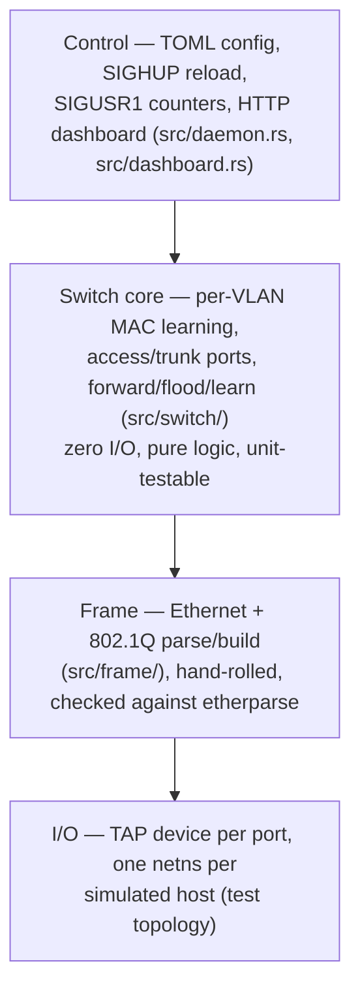
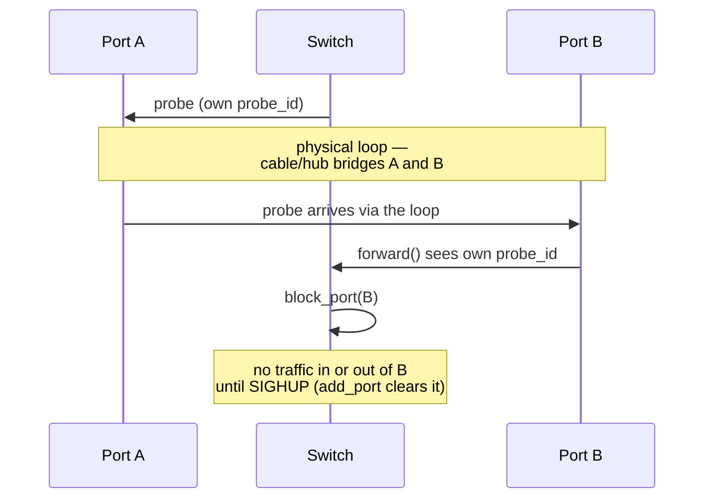
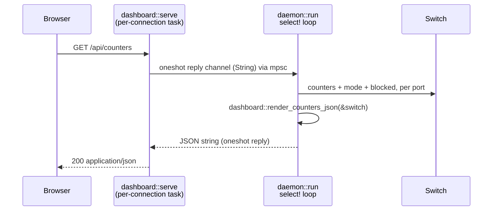

# vlan-rs — design

A real 802.1Q software switch: it parses and builds actual tagged Ethernet
frames and enforces VLAN isolation between real Linux interfaces (TAP
devices, in separate network namespaces for testing), not an in-memory
simulator. This document describes the system as built. For the
commit-by-commit history of *how* it got here, `git log` is authoritative;
this is the current shape, not a changelog.

## The 802.1Q frame

An Ethernet II frame with a 4-byte tag inserted between the source MAC and
the EtherType:

```
Dst MAC (6) | Src MAC (6) | TPID 0x8100 (2) | PCP(3) DEI(1) VID(12) (2) | EtherType (2) | Payload
```

| Field | Size    | Notes |
|-------|---------|-------|
| TPID  | 2 bytes | Fixed `0x8100` for 802.1Q |
| PCP   | 3 bits  | Priority code point — round-tripped only, not enforced |
| DEI   | 1 bit   | Drop eligible indicator — round-tripped only |
| VID   | 12 bits | VLAN ID, 1–4094 valid; 0 and 4095 reserved |

`src/frame/` parses and builds this by hand (`EthernetFrame`, `Dot1qTag`),
deliberately not delegated to a crate: `etherparse` is pulled in only as a
`[dev-dependencies]` cross-check (`tests/frame_roundtrip.rs`), not a
shortcut past writing the bit-twiddling. `cargo-fuzz` (`fuzz/`) feeds
`EthernetFrame::parse` arbitrary bytes and round-trips anything that parses
back through `write_into`, as a CI-run smoke check against the hand-rolled
code most likely to hide an edge case.

## Architecture

Four layers, each depending only on the one below it:



The switch core has no I/O dependencies — ports are just an opaque
`PortId` it forwards `Delivery` values to. That's what makes it
unit-testable over in-process channels, with real VLAN isolation proven
before a kernel is ever in the loop (`tests/switch_vlan_isolation.rs`, 36
tests).

## Switch core

`Switch` (`src/switch/forwarding.rs`) owns:

- **Per-VLAN MAC learning** (`src/switch/mac_table.rs`) — a `(Vlan, MAC)
  → PortId` table, scoped per VLAN so a lookup in one VLAN can never
  resolve into another. Entries age out (`Switch::age_out`) if not
  *re-learned* within `MAC_MAX_AGE` (300s) — a lookup as a destination
  never refreshes an entry, matching real hardware.
- **Access and trunk ports** (`src/switch/port.rs`) — `PortMode::Access`
  (one untagged VLAN) or `PortMode::Trunk` (a tagged `allowed` set plus an
  optional untagged `native` VLAN). A tagged frame on an access port, or an
  untagged frame on a trunk with no native VLAN, is a protocol violation,
  not silently accepted.
- **Forward/flood/learn** (`Switch::forward`) — resolves the ingress VLAN,
  learns the source, then unicasts to a known destination or floods
  within that VLAN, excluding the ingress port and any loop-guard-blocked
  port.
- **Per-port/per-VLAN counters** (`src/switch/counters.rs`) — frames/bytes
  in and out, plus drops. Surfaced by `SIGUSR1` and the dashboard.

## I/O and control

`src/io/` opens a TAP device per port (`tun-rs`); `src/daemon.rs` runs one
`tokio::select!` loop that owns `Switch` and every port's reader/writer
tasks — deliberately single-task, so the switch core and port table need
no locking despite every port's reader feeding them concurrently. TAP
creation needs `CAP_NET_ADMIN`; `sudo setcap cap_net_admin+ep
target/debug/vlan-rs` once means the switch binary itself never runs as
root.

Topology comes from either inline CLI args (`<tap-name>:<vlan-id>` /
`<tap-name>:trunk:<native-or-->:<allowed-csv>`) or a TOML file
(`--config <path.toml>`). `SIGHUP` reloads the TOML file — a full
teardown-and-rebuild of every port, not a diff against the running config;
simpler to reason about correctly, at the cost of briefly interrupting
ports the reload didn't even change. `SIGUSR1` dumps every port's and
VLAN's counters to stderr.

## Loop guard

vlan-rs has no spanning tree; a real loop in the topology causes an
unbounded broadcast storm. Full STP is out of scope by design — instead,
each `Switch` gets a random 64-bit `probe_id` and `daemon.rs` broadcasts a
probe frame (reserved EtherType `0x88B7`, magic-prefixed payload) out
every port every 5s. A probe is recognized and pulled out of the data path
entirely before any VLAN/tag processing, the same way a real switch
special-cases BPDUs:



**Scope limitation:** this only catches a *self*-loop — two ports of the
*same* switch instance bridged together. A probe crossing to a
neighboring vlan-rs switch is recognized as "not mine" and silently
absorbed rather than flooded onward, so it never makes it back to its
originator; the most common storm-causing topology in practice (a loop
formed by two switches and two links between them) is **not** detected.
Closing that gap would mean flooding unrecognized probes instead of
dropping them, which risks a probe outliving the loop that produced it —
out of scope for this lightweight guard.

A probe id is broadcast in the clear on every port, including access
ports facing untrusted hosts — anything on the wire can echo it back and
block its own ingress port (self-harm on an access port; a one-frame,
segment-wide DoS if replayed from behind a trunk). Real switches answer
this with BPDU guard plus `errdisable` auto-recovery after a timeout; this
guard has no such timeout — recovery is `SIGHUP`-only — an accepted gap
for a lightweight self-loop guard, not full spanning tree.

## Dashboard

Opt-in via `--dashboard <bind-addr>` (e.g. `--dashboard 127.0.0.1:8080`).
`GET /api/counters` serves the same per-port/VLAN counters `SIGUSR1`
already dumps, plus each port's live mode (access/trunk, VLAN
membership), as JSON; `GET /` serves a small auto-refreshing HTML page —
vanilla JS, no build step. Hand-rolled HTTP, not a framework: no
keep-alive, no chunked encoding, no header parsing beyond the request
line, `Connection: close` on every response. The only new dependency
surface is two extra `tokio` features (`net`, `io-util`).

`Switch` is owned by `daemon::run`'s single `select!` loop and never
shared behind a lock, so a dashboard connection can't read it directly.
Instead, a request for `/api/counters` sends a `oneshot` reply channel
through an `mpsc` queue into that loop:



The same pattern `SIGUSR1` already uses conceptually — an external
trigger asks the owning task to read its own state — just replacing
"print to stderr" with "hand back a string over a channel". A `SIGHUP`
reload is transparent to it for the same reason: the listener task never
holds a reference to `switch`.

`u64` counters are quoted as JSON strings, not bare numbers — a bare
integer above 2^53 (~9 petabytes of traffic, reachable on a long-running
switch) would silently lose precision the moment a browser's
`JSON.parse` hands it to an `f64`; `index.html` reads them back with
`BigInt`.

No auth: the same trust model as `SIGUSR1` (anyone who can already signal
the process can already dump these counters). Binding beyond `127.0.0.1`
is the operator's explicit, informed choice, documented in
`--dashboard`'s own help text rather than gated in code.

## Testing approach

- **Pure-logic unit tests** — frame round-trip tests, switch-core
  forwarding/learning/loop-guard tests over in-process channels, dashboard
  JSON rendering against a real `Switch`. Fast, no privileges needed.
- **Real HTTP, no kernel** — `tests/dashboard.rs` drives `dashboard::serve`
  over a genuine `TcpListener`/`TcpStream` on `127.0.0.1:0`. The one
  acceptance suite here that needs neither `sudo` nor a TAP device.
- **Scripted netns/TAP acceptance tests** (`scripts/*.sh`, `smoke-tests`
  CI job) — real `ping` through real TAP ports proves what a mocked-port
  unit test can't: wrong length fields, a tag that should've been
  stripped on egress but wasn't, a loop actually getting detected on real
  hardware framing. `ubuntu-latest` runners have passwordless `sudo` and
  netns/bridge support, so these run on every push/PR, not just when a
  human runs them locally.
- **Hardware-in-the-loop (optional)** — netns + veth is still
  same-kernel, same-driver on both sides; a real managed switch and
  separate physical Linux boxes catch what that can't (a vendor's own
  802.1Q quirks, real NIC/driver behavior, actual link timing). Not part
  of CI — an escalation, most useful around trunk-port interop.

## Verification

| Capability | How we know it works |
|---|---|
| Frame parser | `cargo test --test frame_roundtrip`; `cargo +nightly fuzz run parse_frame` |
| Switch core / VLAN isolation | `tests/switch_vlan_isolation.rs` — frames tagged for VLAN 10 never reach a port only in VLAN 20 |
| TAP + netns | `scripts/netns-smoke-test.sh` — `ping` between two namespaces succeeds only through the switch's TAP ports |
| Trunk ports | `scripts/trunk-smoke-test.sh` — two switch instances linked by a trunk correctly tag on egress / strip on ingress |
| Config & CLI | `scripts/config-reload-smoke-test.sh` — a TOML file reproduces a port/VLAN layout on startup; `SIGHUP` rebuilds real TAP ports to match an edited config without restarting |
| CI harness | `smoke-tests` job passes on every PR |
| `cargo-fuzz` | `fuzz` job passes (60s bounded run, zero crashes) on every PR |
| MAC aging | `ages_out_stale_entries_but_keeps_fresh_ones`, `lookups_never_refresh_an_entrys_age` — a fake clock advanced past the threshold, no real time passing |
| Loop guard | `scripts/loop-guard-smoke-test.sh` — bridge a switch's two access ports directly together (a self-loop) and confirm both get detected and blocked, plus unit tests in `tests/switch_vlan_isolation.rs` |
| Web dashboard | `tests/dashboard.rs` (JSON rendering + live HTTP, no `sudo`/TAP); `scripts/dashboard-smoke-test.sh` for the real-TAP-traffic end, both in the `smoke-tests` CI job |

## Not built

- **QinQ** (double-tagged frames, outer S-VLAN TPID `0x88a8`) — no
  concrete driving use case; would need a second outer-tag field in
  `EthernetFrame`, nested `parse`/`write_into`, and a trunk "provider"
  mode.
- **Multi-switch loop detection** — see Loop guard's scope limitation,
  above.
- **A diffing, no-flap config reload** — `SIGHUP` always tears down and
  rebuilds every port; a version that only touches what actually changed
  remains a possible refinement, not built.
- **Dashboard auth / auto-recovery timeout on blocked ports** — both
  accepted gaps for this project's scope; see Loop guard and Dashboard,
  above.
